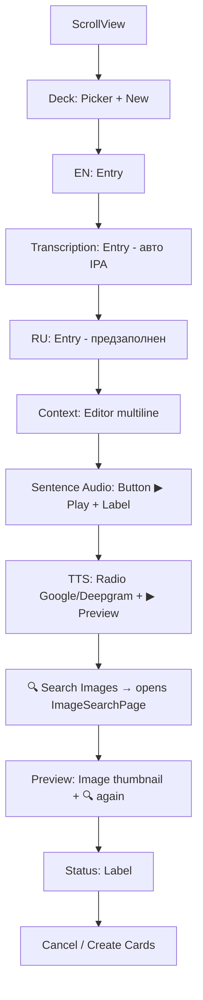

# AnkiCardPage v0.1 — План реализации (Android MAUI)

## Выбранный подход: Вариант B — Модальный полноэкранный WebView

Основная страница с полями карточки + кнопка «🔍 Search images», открывающая **модальную страницу** `ImageSearchPage` с WebView на весь экран. После выбора картинки — возврат с URL на основную страницу.

---

## 1. Что уже есть (shared из WPF)

| Компонент | Файл | Статус |
|-----------|------|--------|
| AnkiBuilder | [`AnkiBuilder.cs`](c:/ProjectsCSharp/RepeatSegment/RepeatSegment.App/AnkiBuilder.cs) | ✅ Shared via Link |
| AnkiExportManager | [`AnkiExportManager.cs`](c:/ProjectsCSharp/RepeatSegment/RepeatSegment.App/AnkiExportManager.cs) | ✅ Shared via Link |
| ConfigManager | [`ConfigManager.cs`](c:/ProjectsCSharp/RepeatSegment/RepeatSegment.App/ConfigManager.cs) | ✅ Shared, поле `ImageSearchProvider` уже есть |
| TranslationProvider | [`TranslationProvider.cs`](c:/ProjectsCSharp/RepeatSegment/RepeatSegment.App/TranslationProvider.cs) | ✅ Shared |
| TtsProvider | [`TtsProvider.cs`](c:/ProjectsCSharp/RepeatSegment/RepeatSegment.App/TtsProvider.cs) | ✅ Shared |
| AudioEngine | [`AudioEngine.cs`](RepeatSegment.Maui/Services/AudioEngine.cs) | ✅ Работает (извлечение MP3-сниппетов) |

---

## 2. Файлы для создания / изменения

### Новые файлы

| # | Файл | Назначение |
|---|------|-----------|
| 1 | `RepeatSegment.Maui/Pages/AnkiCardPage.xaml` | UI: поля карточки + кнопка поиска картинок + превью |
| 2 | `RepeatSegment.Maui/Pages/AnkiCardPage.xaml.cs` | Логика: авто-IPA, загрузка дек, создание карточек |
| 3 | `RepeatSegment.Maui/Pages/ImageSearchPage.xaml` | Модальный WebView на весь экран + кнопка «✓ Use» |
| 4 | `RepeatSegment.Maui/Pages/ImageSearchPage.xaml.cs` | WebView + JS-инжекция (Google/Yandex), скачивание картинки |

### Изменяемые файлы

| # | Файл | Изменение |
|---|------|-----------|
| 5 | `AppShell.xaml` / `AppShell.xaml.cs` | Зарегистрировать маршрут `AnkiCardPage` |
| 6 | `PlayerPage.xaml.cs` → `OnAnkiClicked()` | Открыть `AnkiCardPage` с параметрами (word, translation, context, wordTimings, audio, providers) |
| 7 | `SettingsPage.xaml` / `SettingsPage.xaml.cs` | Добавить `Picker` для `ImageSearchProvider` (Google/Yandex) |

---

## 3. Решённые проблемы из WPF (AI_NOTES.md)

Все сложности с захватом картинок задокументированы в [`AI_NOTES.md`](c:/ProjectsCSharp/RepeatSegment/AI_NOTES.md), строки 146-163:

### Google Images
- **Shadow DOM**: Google использует Shadow DOM → обычные селекторы не работают. Решение: `document.elementsFromPoint()` — единственный API, пробивающий Shadow DOM.
- **encrypted-tbn URL**: Миниатюры зашифрованы, HTTP-запрос к ним → 429. Решение: извлекать `imgurl` из `<a href="/imgres?imgurl=REAL_URL">`.
- **Анти-бот**: `navigator.webdriver=false`, `window.chrome={runtime:{}}`, CONSENT/NID cookies.
- **Загрузка**: Основной метод — JS `fetch(url, {credentials:'include'})` внутри WebView (использует cookie-сессию браузера). Fallback — HttpClient с User-Agent Chrome 125.
- **Боковая панель**: После клика боковая панель грузится асинхронно → `findBestImg()` сканирует `querySelectorAll('img[src^="http"]')` с фильтром `naturalWidth > 150`.

### Yandex Images
- Проще, чем Google — нет Shadow DOM, нет encrypted-tbn.
- `document.elementsFromPoint()` ищет `img` с `src` начинающимся на `http`.
- Fallback: подъём по `parentElement` в поисках `` внутри `<picture>`.
- Referrer: `https://yandex.ru/`.

### Выбор провайдера
- `ConfigManager.ImageSearchProvider` = `"google"` или `"yandex"` (из `config.ini`: `image_search_provider = google`).
- В WPF: `GeneralSettingsWindow.xaml` → `ComboBox` с Google/Yandex.
- В MAUI: нужно добавить в `SettingsPage`.

---

## 4. Детальный UI: AnkiCardPage



### Поля (адаптировано с WPF)

| Поле | Тип | Источник |
|------|-----|----------|
| Deck | `Picker` | `AnkiExportManager.ListDecks()` + кнопка «New» (`DisplayPromptAsync`) |
| EN word | `Entry` | Авто из выделения в PlayerPage |
| Transcription (IPA) | `Entry` | Авто-поиск через `api.dictionaryapi.dev` (тот же код, что в WPF) |
| RU translation | `Entry` | Авто из `TranslationProvider` (передаётся из PlayerPage) |
| Context | `Editor` (3 строки) | Предложение-источник из `WordTimings` |
| Sentence audio | `Button` + `Label` | `AudioEngine.SaveSnippetMp3(t1, t2)` + `FindSentenceBounds()` |
| TTS | `RadioButton` Google + Deepgram | `TtsProvider.DownloadGoogleTtsToFile / DownloadDeepgramTtsToFile` |
| Picture | `Image` (preview) + `Button` «🔍 Search» | Открывает `ImageSearchPage` |
| Status | `Label` | Статус операций |
| Buttons | `Cancel` / `Create Cards` | `AnkiExportManager.AddNote()` + `Finalize()` |

### Упрощения для v0.1 (по сравнению с WPF)
- ❌ Запись с микрофона (NAudio не портирован, сложно для v0.1)
- ❌ Auto-play sentence (только кнопка ▶)
- ❌ Слияние с существующей колодой (MVP: всегда новая колода)
- ❌ Intent share в AnkiDroid (сохраняем .apkg в файлы)

---

## 5. Детальный UI: ImageSearchPage (модальный WebView)

```
┌─────────────────────────┐
│ ← Back    🔍 Search     │  ← Toolbar
├─────────────────────────┤
│ [Entry: search query]   │  ← Поле поиска (предзаполнено словом)
│ [Search] [✓ Use]        │  ← Кнопки
├─────────────────────────┤
│                         │
│    WebView              │  ← Полноэкранный браузер
│    (Google Images       │
│     или Yandex Images)  │
│                         │
├─────────────────────────┤
│ Status: Click image...  │  ← Статус-бар
└─────────────────────────┘
```

### Логика работы
1. При открытии: WebView загружает `https://www.google.com/search?tbm=isch&q=WORD` (или Yandex)
2. После загрузки страницы: инжектируется JS (код из WPF `AnkiCardWindow.xaml.cs:176-214`):
   - Google: `navigator.webdriver=false`, click-обработчик через `document.elementsFromPoint()`, `findBestImg()`
   - Yandex: click-обработчик через `document.elementsFromPoint()`, поиск `img src`
3. Пользователь кликает по картинке → JS сохраняет URL в `window.__img`
4. Пользователь жмёт «✓ Use» → вызывается `EvaluateJavaScriptAsync("window.__img")` → URL извлечён
5. C# скачивает картинку:
   - **Основной метод**: `fetch` из WebView (cookies браузера)
   - **Fallback**: `HttpClient` с браузерными заголовками
6. Ресайз через SkiaSharp (`SKBitmap.Decode` → resize → JPEG 75%)
7. Сохранение в `decks/media/`
8. Возврат на `AnkiCardPage` с путём к файлу (через `MessagingCenter` или `TaskCompletionSource`)

---

## 6. Передача данных между страницами

### PlayerPage → AnkiCardPage
```csharp
// PlayerPage.OnAnkiClicked()
var navParams = new Dictionary<string, object>
{
    ["selectedWord"] = selectedText,
    ["context"] = contextSentence,
    ["wordStart"] = wordStartSeconds,
    ["wordEnd"] = wordEndSeconds,
    ["ruTranslation"] = translationResult,
    ["matchedWord"] = matchedWord,  // для IPA поиска
    ["wordTimings"] = _transcriptionProvider.WordTimings,
    ["audio"] = _audio,
};
await Shell.Current.GoToAsync("ankiCard", navParams);
```

### AnkiCardPage ↔ ImageSearchPage
```csharp
// Открытие
string? imagePath = await Navigation.PushModalAsync(new ImageSearchPage(query, provider));
// ImageSearchPage возвращает путь через MessagingCenter или TaskCompletionSource
```

---

## 7. Порядок реализации (5 шагов)

### Шаг 1: SettingsPage — ImageSearchProvider
- Добавить `Picker` в [`SettingsPage.xaml`](RepeatSegment.Maui/Pages/SettingsPage.xaml) с Google/Yandex
- Сохранять/загружать через `ConfigManager.ImageSearchProvider`

### Шаг 2: ImageSearchPage (WebView)
- Создать XAML: `WebView` + `Entry` для query + кнопки
- Портировать JS-инжекцию из WPF `AnkiCardWindow.xaml.cs:147-228`
- Реализовать загрузку картинки: `EvaluateJavaScriptAsync` → `HttpClient`
- Ресайз через SkiaSharp, сохранение в `decks/media/`

### Шаг 3: AnkiCardPage — поля + IPA
- Создать XAML макет (ScrollView, все поля)
- Авто-заполнение EN, RU, Context из параметров
- Авто-поиск IPA (`LookupIpaAsync` из WPF `AnkiCardWindow.xaml.cs:89-145`)
- Загрузка дек через `AnkiExportManager.ListDecks()`

### Шаг 4: AnkiCardPage — аудио
- Sentence audio: `FindSentenceBounds()` + `_audio.SaveSnippetMp3()`
- TTS: Google TTS через `TtsProvider.DownloadGoogleTtsToFile()`
- Deepgram TTS: через `TtsProvider.DownloadDeepgramTtsToFile()`

### Шаг 5: AnkiCardPage — создание карточки
- `BtnCreate_Click`: собрать все поля → `AnkiExportManager`
- Кнопка «Open deck»: показать путь к .apkg
- Интеграция с PlayerPage: `OnAnkiClicked()` → открытие AnkiCardPage

---

## 8. Важные технические моменты для Android

### WebView на Android
- MAUI `WebView` использует системный Android WebView (Chromium-based)
- `EvaluateJavaScriptAsync()` — аналог `ExecuteScriptAsync()` из WebView2
- Cookie-менеджер: `Android.Webkit.CookieManager` вместо `CoreWebView2.CookieManager`
- **User-Agent по умолчанию — мобильный** (Chrome Mobile). Google Images в мобильной версии может работать иначе. Возможно, потребуется установить десктопный User-Agent:
  ```csharp
  webView.Source = new UrlWebViewSource { Url = url };
  // В custom handler или через platform-specific код:
  #if ANDROID
  var androidWebView = webView.Handler?.PlatformView as Android.Webkit.WebView;
  androidWebView?.Settings?.UserAgentString = "Mozilla/5.0 Chrome/125.0.0.0 Safari/537.36";
  #endif
  ```

### Google Images на мобильном WebView
- **Риск**: Google может показывать капчу или блокировать мобильный WebView
- **Решение из WPF**: CONSENT/NID cookies + `navigator.webdriver=false`
- **Дополнительно для Android**: установить `WebView` User-Agent как десктопный Chrome
- **Yandex Images**: должен работать без проблем (менее строгие anti-bot меры)

### SkiaSharp для ресайза картинок
- `SKBitmap.Decode(byte[])` уже используется в проекте (waveform) — ✅ работает
- Ресайз до max 600px (как в WPF), JPEG quality 75%

### Аудио на Android
- `AudioEngine.SaveSnippetMp3(t1, t2)` — нужно проверить, реализован ли метод в Android-версии
- Если нет — добавить (MediaExtractor извлечение + MediaMuxer запись в MP3)

---

## 9. Конфигурация config.ini (уже есть в ConfigManager)

```ini
[Settings]
image_search_provider = google
# или: image_search_provider = yandex
```

Поле `ImageSearchProvider` уже есть в [`ConfigManager.cs:44`](c:/ProjectsCSharp/RepeatSegment/RepeatSegment.App/ConfigManager.cs:44), парсится в строке 108.

---

## 10. Что НЕ делаем в v0.1

- Запись с микрофона (Record audio) — NAudio не портирован
- Auto-play sentence при открытии карточки
- Слияние с существующей колодой (всегда новый .apkg)
- Intent share в AnkiDroid (сохраняем локально)
- Content-based дедупликация медиа
- Предпросмотр TTS перед скачиванием (сразу скачиваем)
